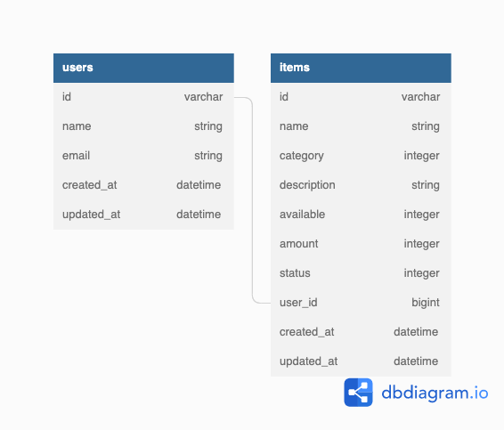

# **Craft Circle BE**

<!-- ALL-CONTRIBUTORS-BADGE:START - Do not remove or modify this section -->

<!-- ALL-CONTRIBUTORS-BADGE:END -->

  

## **Background and Description**
[Craft Circle BE](https://github.com/Craft-Circle/craft_circle_be) is the "Back End" rails application API that acts as a microservice for the [Craft Circule UI](https://github.com/Craft-Circle/craft-circle-ui) web application. The database is accessed through GraphQL endpoint where a post request has acceess to queries and muations.
- [Craft Circle App](https://craft-circle.herokuapp.com) 
- [Capstone Project](https://mod4.turing.edu/projects/capstone/) 
- [Figma Board](https://www.figma.com/files/team/1126568384966913890/Craft-Circle?fuid=1042180732312868322) 

---
## **Table of Contents**
- [Background and Description](#background-and-description)
- [Schema](#schema)
- [Requirements and Setup (for Mac):](#requirements-and-setup-for-mac)
    - [Ruby and Rails Versions](#ruby-and-rails-versions)
    - [Gems Utilized](#gems-utilized)
    - [SetUp](#setup)
- [Heroku Setup](#heroku-setup)
- [GraphQL Endpoints](#graphql-endpoints)
- [Contributors](#contributors-)
---
## **Schema**

## **Requirements and Setup (for Mac):**

### **Ruby and Rails Versions**
---
- Ruby Version 2.7.4
- Rails Version 5.2.8

### **Gems Utilized**
---
- [capybara](https://github.com/teamcapybara/capybara)
- [faker](https://github.com/faker-ruby/faker)
- [factory_bot_rails](https://github.com/thoughtbot/factory_bot_rails)
- [faraday](https://github.com/lostisland/faraday)
- [figaro](https://github.com/laserlemon/figaro)
- [graphql](https://graphql.org/learn/)
- [graphql-ruby docs](https://graphql-ruby.org/guides)
- [graphiql-rails](https://github.com/graphql/graphiql)
- [jsonl](https://github.com/zenizh/jsonl)
- [launchy](https://github.com/copiousfreetime/launchy)
- [pry](https://github.com/pry/pry)
- [shoulda-matchers](https://github.com/thoughtbot/shoulda-matchers)
- [simplecov](https://github.com/simplecov-ruby/simplecov)
- [rspec_junit_formatter](https://github.com/sj26/rspec_junit_formatter)
- [rspec](https://relishapp.com/rspec)

## **Setup**
See this [Rails Setup Guide](./docs/setup/rails_setup.md) for detailed instructions on how to deploy the app in a local environment.

## **Heroku Setup**
See this [Heroku Deployment Guide](./docs/setup/heroku_setup.md) for detailed instructions on how to deploy the app to heroku.
## **GraphQL Endpoints**
Our GraphQL endpoints fall into two categories: queries and mutations. For detailed examples of all the endpoints and example responses, see our [GraphQL #Endpoints Guide](./docs/graphql) or click the specific query or mutation below to go its section.

To make live queries to the GraphQL endpoint and see live schema information, setup the back-end using the [rails setup guide](./docs/setup/rails_setup.md) and access GraphiQL at `http://localhost:5000/graphiql`.

Queries
- [User Queries](./docs/graphql/queries.md#user-q)
    - [getUsers](./docs/graphql/queries.md#get-users)
    - [getAUser](./docs/graphql/queries.md#get-user)
    - [getUserItems](./docs/graphql/queries.md#get-user-items)
- [Item Queries](./docs/graphql/queries.md#item-q)
    - [getItems](./docs/graphql/queries.md#get-items)
    - [itemSearch](graphql_endpoints.md#item-search)
    - [filterByCategory](graphql_endpoints.md#filter-by-category)

Mutations
- [User Mutations](./docs/graphql/mutations.md#user-m)
    - [createUser](./docs/graphql/mutations.md#create-user)
    - [editUser](./docs/graphql/mutations.md#edit-user)
    - [deleteUser](./docs/graphql/mutations.md#delete-user)
- [Item Mutations](./docs/graphql/mutations.md#item-m)
    - [createItem](./docs/graphql/mutations.md#create-item)
    - [editItem](./docs/graphql/mutations.md#edit-item)
    - [deleteItem](./docs/graphql/mutations.md#delete-item)

## **Contributors ✨**

Thanks go to these wonderful people ([emoji key](https://allcontributors.org/docs/en/emoji-key)):

<!-- ALL-CONTRIBUTORS-LIST:START - Do not remove or modify this section -->
<!-- prettier-ignore-start -->
<!-- markdownlint-disable -->
<table>

  <tr>

   <td align="center"> <b>Sherman Au (he/him)</b>  <a href="https://github.com/ShermanA-13" title ="GitHub"></td>

   <td align="center"> <b>Joseph Downs (he/him)</b></a>  <a href="https://github.com/josephdowns" title ="GitHub"></td>

   <td align="center"> <b>Phillp Kamps (he/him)</b></a>  <a href="https://github.com/phillipkamps/landing_page" title ="GitHub"></td>

   <td align="center"> <b>Sandiz Thieme (he/him)</b></a>  <a href="https://github.com/sandisz-d734m37" title="GitHub"></td>

  </tr>
</table>

<!-- markdownlint-restore -->
<!-- prettier-ignore-end -->

<!-- ALL-CONTRIBUTORS-LIST:END -->

This project follows the [all-contributors](https://github.com/all-contributors/all-contributors) specification.
<!--
